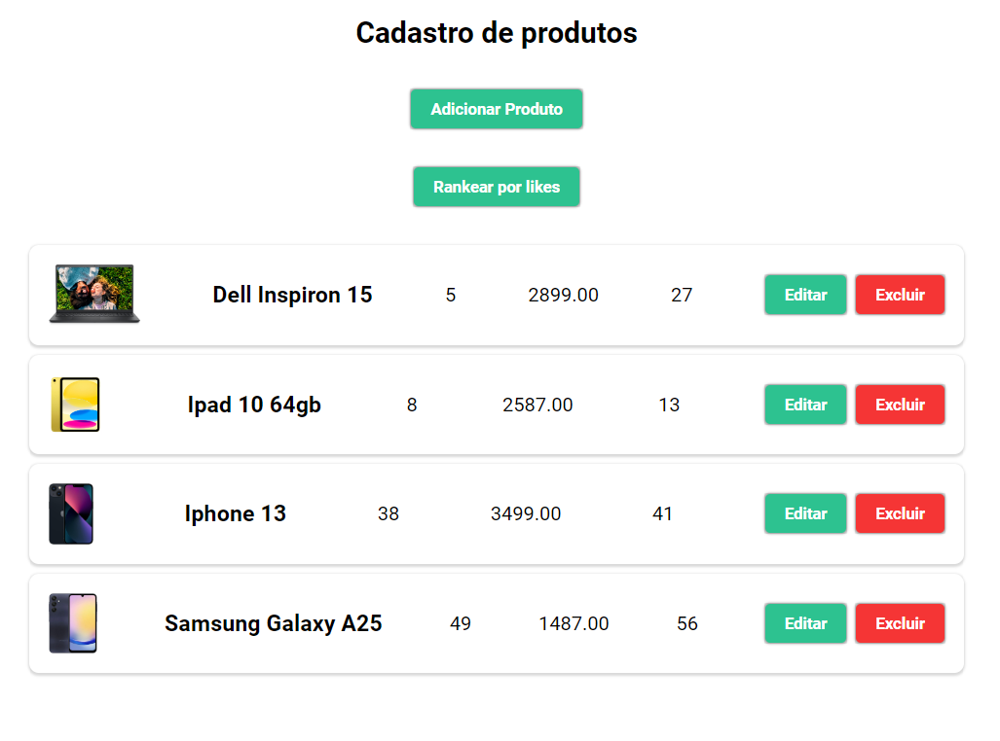
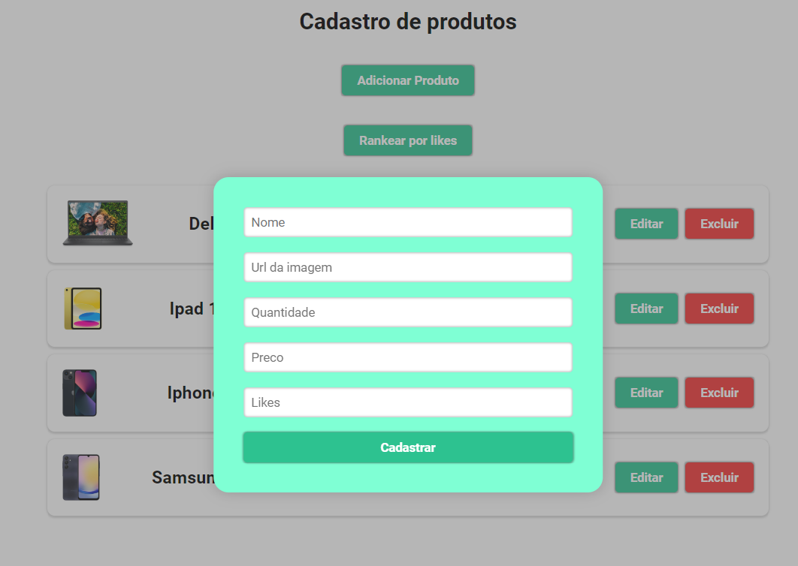
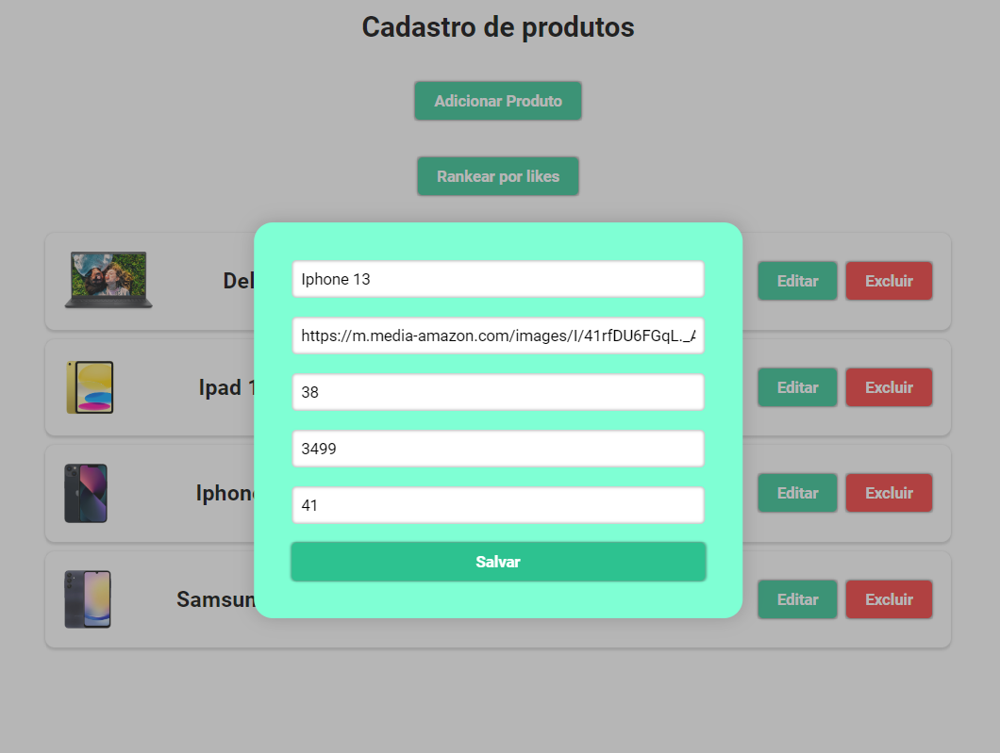

# Task 01 de Redux - CRUD com Ranking

Crud de produtos feito para o módulo de redux do programa VemSer14 da DBC

## Tecnologias utilizadas

- Redux - Para gerenciamento de estados.
- SASS - Para estilização.
- React Router DOM - Para mapeamento de rotas.
- React Hook Form - Para uso otimizado de formulários.

## Telas

#### Tela Principal

 

 
#### Tela de cadastro

 

 
#### Tela de edição

 